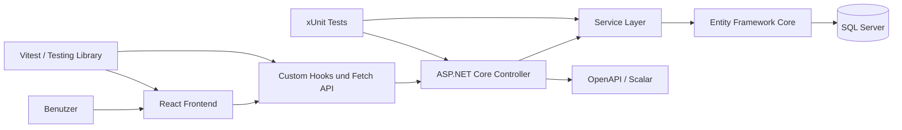
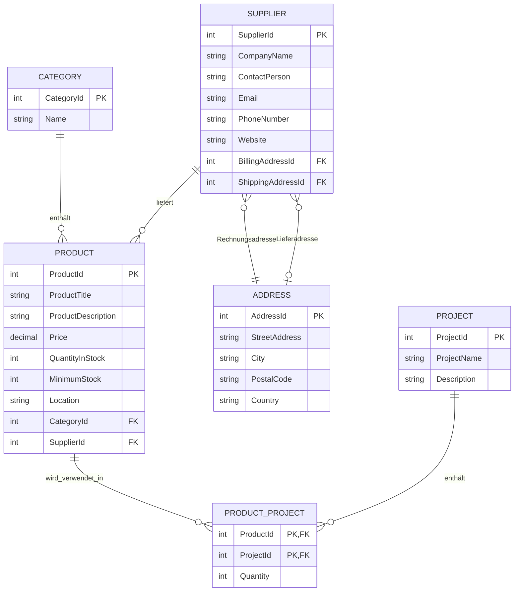

# Inventory Dashboard

> Fullstack-Webanwendung zur zentralen Verwaltung von Produkten, Lagerbeständen, Kategorien, Lieferanten und Projekten.

[](https://dotnet.microsoft.com/)
[](https://react.dev/)
[](https://www.microsoft.com/sql-server)
[](#tests)

## Über das Projekt

Das **Inventory Dashboard** ist eine responsive Fullstack-Anwendung für kleine und mittlere Unternehmen, die ihre Lagerdaten strukturiert verwalten möchten. Die Anwendung verbindet ein React-Frontend mit einer REST-API auf Basis von ASP.NET Core und einer relationalen SQL-Server-Datenbank.


Das Repository zeigt insbesondere meine Kenntnisse in:

- Fullstack-Entwicklung mit React und ASP.NET Core
- Entwurf und Implementierung einer REST-API
- relationaler Datenmodellierung mit Entity Framework Core
- wiederverwendbaren Frontend-Komponenten und Custom Hooks
- Formularvalidierung, Fehlerbehandlung und CRUD-Prozessen
- Unit-, Controller- und Integrationstests

## Hauptfunktionen

### Dashboard

- zentrale Übersicht über Produkte, Kategorien und Lieferanten
- Erkennung von Produkten mit niedrigem Lagerbestand
- Diagramme für Produkte pro Kategorie und Lieferant
- Darstellung der Produkte mit dem höchsten Bestand

### Produktverwaltung

- Produkte erstellen, anzeigen, bearbeiten und löschen
- Suche nach Produktname oder Beschreibung
- Filterung nach Kategorie und Lieferant
- Verwaltung von Preis, Lagerbestand, Mindestbestand und Lagerort
- serverseitige Pagination

### Lieferantenverwaltung

- Lieferanten vollständig verwalten
- Kontaktangaben sowie Rechnungs- und optionale Lieferadresse erfassen
- Suche nach Firma, Kontaktperson oder Ort
- validierte E-Mail-, URL- und Adressfelder

### Kategorien und Projekte

- Kategorien erstellen, bearbeiten und löschen
- Projekte mit Beschreibung verwalten
- Produkte einem Projekt inklusive benötigter Menge zuordnen
- Many-to-Many-Beziehung zwischen Produkten und Projekten

### Qualität und Wartbarkeit

- klar getrennte Controller-, Service-, DTO- und Datenzugriffsschichten
- asynchrone Datenbankzugriffe mit Entity Framework Core
- `AsNoTracking()` für reine Leseabfragen
- Data-Annotation-Validierung für API-Modelle
- wiederverwendbare Tabellen-, Formular-, Modal- und Layout-Komponenten
- zentrale API-Kommunikation über einen wiederverwendbaren React Hook
- OpenAPI-Spezifikation und Scalar API Reference im Development-Modus
- automatische Beispieldaten für eine direkt befüllte Entwicklungsumgebung

## Technologie-Stack

| Bereich | Technologien |
|---|---|
| Frontend | React 19, JavaScript, React Router, Bootstrap 5, Bootstrap Icons |
| Visualisierung | Chart.js, react-chartjs-2 |
| Backend | ASP.NET Core 9, C# 13, REST API |
| Datenzugriff | Entity Framework Core 9 |
| Datenbank | Microsoft SQL Server |
| API-Dokumentation | OpenAPI, Scalar |
| Frontend-Tests | Vitest, React Testing Library, jest-dom |
| Backend-Tests | xUnit, FluentAssertions, ASP.NET Core Testing, EF Core InMemory |
| Build & Tooling | Vite 8, ESLint, Prettier, npm, .NET CLI |

## Architektur



Das Frontend übernimmt Darstellung, Navigation, Formulare und Benutzerinteraktionen. Die REST-Controller stellen die HTTP-Endpunkte bereit und delegieren die Geschäfts- und Datenzugriffslogik an Services. DTOs bilden eine kontrollierte Schnittstelle zwischen API und Client. Entity Framework Core übernimmt das Mapping auf die SQL-Server-Datenbank.

## Datenmodell



## Repository-Struktur

```text
InventoryDashboard/
├── backend/
│   └── InventoryDashboard.Api/
│       ├── Controllers/        # REST-Endpunkte
│       ├── Data/               # DbContext und Seed-Daten
│       ├── Dtos/               # Request- und Response-Modelle
│       ├── Entities/           # Datenbankentitäten
│       └── Services/           # Geschäfts- und Datenzugriffslogik
├── frontend/
│   └── inventory-dashboard.web/
│       ├── src/components/     # Wiederverwendbare UI-Komponenten
│       ├── src/hooks/          # API- und Resource-Hooks
│       ├── src/pages/          # Dashboard- und CRUD-Seiten
│       ├── src/charts/         # Chart.js-Konfiguration
│       └── src/test/           # Test-Setup
├── InventoryDashboard.Api.Tests/
│   ├── Controllers/            # Controller-Unit-Tests
│   ├── Services/               # Service-Unit-Tests
│   └── Integration/            # API-Integrationstests
└── InventoryDashboard.slnx
```

## Lokale Installation

### Voraussetzungen

- [.NET 9 SDK](https://dotnet.microsoft.com/download/dotnet/9.0)
- [Node.js](https://nodejs.org/) mit npm
- Microsoft SQL Server, lokal oder in einem Container
- optional: `dotnet-ef` für die Erstellung und Aktualisierung des Datenbankschemas

### 1. Repository vorbereiten

Klone das Repository über GitHub oder lade es als ZIP-Datei herunter. Wechsle danach in das Projektverzeichnis:

```bash
cd InventoryDashboard
```

### 2. Datenbankverbindung konfigurieren

Hinterlege die Verbindungszeichenfolge nicht mit einem echten Passwort im Repository. Die ASP.NET-Core-Konfiguration kann über eine Umgebungsvariable überschrieben werden.

**PowerShell:**

```powershell
$env:ConnectionStrings__InventoryDb="Server=localhost,1433;Database=InventoryDb;User Id=sa;Password=<DEIN_PASSWORT>;TrustServerCertificate=True;"
```

**Bash:**

```bash
export ConnectionStrings__InventoryDb="Server=localhost,1433;Database=InventoryDb;User Id=sa;Password=<DEIN_PASSWORT>;TrustServerCertificate=True;"
```

### 3. Datenbankschema erstellen

Beim ersten lokalen Start kann das Schema mit Entity Framework Core erzeugt werden:

```bash
cd backend/InventoryDashboard.Api
dotnet tool install --global dotnet-ef
dotnet ef migrations add InitialCreate
dotnet ef database update
```

Die Anwendung fügt beim Start Beispieldaten ein, sofern noch keine Produkte vorhanden sind.

### 4. Backend starten

```bash
dotnet restore
dotnet run --launch-profile http
```

Das Backend ist anschliessend erreichbar unter:

- API: `http://localhost:5099`
- OpenAPI-Dokument: `http://localhost:5099/openapi/v1.json`
- Scalar API Reference: `http://localhost:5099/scalar/v1`

### 5. Frontend starten

Öffne ein zweites Terminal:

```bash
cd frontend/inventory-dashboard.web
npm install
npm run dev
```

Das Frontend ist erreichbar unter `http://localhost:5173` und verbindet sich automatisch mit der API auf Port `5099`.

## API-Übersicht

| Ressource | Endpunkte | Zusätzliche Funktionen |
|---|---|---|
| Dashboard | `GET /api/dashboard/overview` | Kennzahlen und Diagrammdaten |
| Produkte | `GET`, `POST /api/products` · `GET`, `PUT`, `DELETE /api/products/{id}` | Suche, Kategorie-, Lieferantenfilter und Pagination |
| Kategorien | `GET`, `POST /api/categories` · `GET`, `PUT`, `DELETE /api/categories/{id}` | Suche und Pagination |
| Lieferanten | `GET`, `POST /api/suppliers` · `GET`, `PUT`, `DELETE /api/suppliers/{id}` | Suche nach Firma, Kontakt und Ort |
| Projekte | `GET`, `POST /api/projects` · `GET`, `PUT`, `DELETE /api/projects/{id}` | Produktauswahl mit Mengenangaben |

Beispiel für eine gefilterte Produktabfrage:

```http
GET /api/products?search=Monitor&categoryId=1&supplierId=2&page=1&pageSize=10
```

## Tests

Das Repository enthält **236 automatisierte Testfälle**:

- **131 Backend-Tests** für Services, Controller und vollständige API-Integrationen
- **105 Frontend-Tests** für API-Hooks, Zustandsverwaltung, Fehlerfälle und CRUD-Operationen

### Backend-Tests ausführen

Im Repository-Stammverzeichnis:

```bash
dotnet test InventoryDashboard.slnx
```

### Frontend-Tests ausführen

```bash
cd frontend/inventory-dashboard.web
npm test -- --run
```

Zusätzliche Qualitätsprüfungen:

```bash
npm run lint
npm run build
```

## Technische Entscheidungen

### DTOs statt direkter Entity-Ausgabe

Die API verwendet separate Request- und Response-DTOs. Dadurch bleiben Datenbankmodell und öffentliche API voneinander entkoppelt, Eingaben können gezielt validiert werden und der Client erhält nur die benötigten Daten.

### Service Layer

Controller enthalten möglichst wenig Geschäftslogik. Datenbankabfragen, Mapping und CRUD-Abläufe liegen in eigenen Services und können dadurch unabhängig getestet werden.

### Wiederverwendbare Frontend-Abstraktionen

Ein generischer `useApiResource`-Hook kapselt HTTP-Anfragen, Ladezustände und Fehlerbehandlung. Darauf aufbauende Hooks stellen domänenspezifische Operationen für Produkte, Kategorien, Lieferanten, Projekte und das Dashboard bereit.

### Explizite Many-to-Many-Zwischentabelle

Die Verbindung zwischen Produkten und Projekten wird über `ProductProject` modelliert. Die Zwischentabelle speichert zusätzlich die benötigte Produktmenge und bildet damit eine echte fachliche Beziehung ab.

## Mögliche Erweiterungen

- Authentifizierung und rollenbasierte Autorisierung
- Docker Compose für Frontend, API und SQL Server
- CI/CD-Pipeline für Build, Linting und Tests
- versionierte und eingecheckte EF-Core-Migrationen
- strukturierte Fehlerantworten mit `ProblemDetails`
- Deployment in eine Cloud- oder On-Premises-Umgebung
- Audit-Log und Historisierung von Bestandsänderungen
